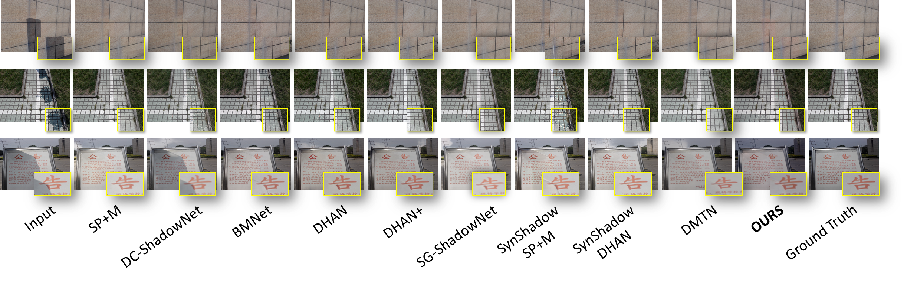
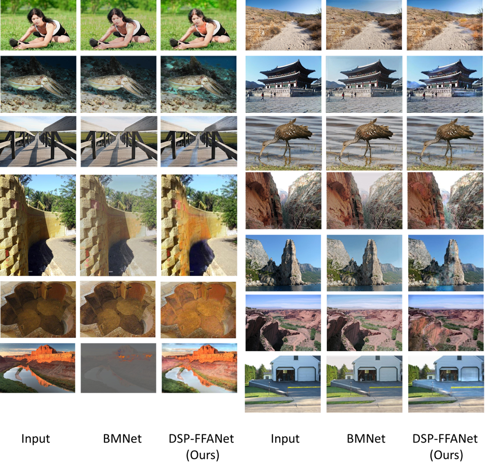

# <center> Training a shadow removal network using only 3D primitive occluders
<!--### <center>In The Visual Computer - Springer*/ -->
### <center>Neil Patrick Del Gallego, Joel Ilao, Macario Cordel II, Conrado Ruiz Jr.</center>
### <center>De La Salle University, Grup de Recerca en Tecnologies Media, La Salle - Universitat Ramon Llull</center>

<center></center>

<br>

<!--### <strong><a href = "https://doi.org/10.1016/j.sigpro.2022.108631"> Paper (in Signal Processing - Elsevier)</a> | <a href = "https://github.com/NeilDG/SynthDehazing">Source code</a> </strong>-->

### <strong>Paper (coming soon)| <a href = "https://github.com/NeilDG/SynthShadowRemoval">Source code</a> </strong>


### Abstract

<p align="justify"> Removing shadows in images is often a necessary pre-processing task for improving the performance of computer vision applications. Deep learning shadow removal approaches require a large-scale dataset that is challenging to gather. To address the issue of limited shadow data, we present a new and cost-effective method of synthetically generating shadows using 3D virtual primitives as occluders. We simulate the shadow generation process in a virtual environment where foreground objects are composed of mapped textures from the Places-365 dataset. We argue that complex shadow regions can be approximated by mixing primitives, analogous to how 3D models in computer graphics can be represented as triangle meshes. We use the proposed synthetic shadow removal dataset, DLSUSynthPlaces-100K, to train a feature-attention-based shadow removal network without explicit domain adaptation or style transfer strategy. The results of this study show that the trained network achieves competitive results with state-of-the-art shadow removal networks that were trained purely on typical SR datasets such as ISTD or SRD. Using a synthetic shadow dataset of only triangular prisms and spheres as occluders produces the best results. Therefore, the synthetic shadow removal dataset can be a viable alternative for future deep-learning shadow removal methods. </p>

### Shadow-Free Image Results
We provide our shadow-free image results on the ISTD and SRD datasets.

<br>
(COMING SOON)
  
### DLSU-SynthPlaces100K (SYNthetic Shadows on Places-365)
Training images used in our paper: <a href = "">DLSU-SynthPlaces100K Dataset </a> <br>
All images are numbered and paired. You can find each of these images, in their corresponding folders. Example: ```synth_0.png``` <br>

  
### Pre-Trained Models
COMING SOON.

<br>
Assuming you have the source project, place all models in <b>"./checkpoint" </b> directory.

### Training
TODO

### Inference
TODO
  
### Citation
TODO

<!--```
@article{DELGALLEGO2022108631,
        title = {A new approach for training a physics-based dehazing network using synthetic images},
        journal = {Signal Processing},
        volume = {199},
        pages = {108631},
        year = {2022},
        issn = {0165-1684},
        doi = {https://doi.org/10.1016/j.sigpro.2022.108631},
        url = {https://www.sciencedirect.com/science/article/pii/S0165168422001712},
        author = {Neil Patrick {Del Gallego} and Joel Ilao and Macario Cordel and Conrado Ruiz}
}
```-->

### Acknowledgements
We would like to acknowledge De La Salle University (DLSU), Department of Science and Technology (DOST), and the Google Cloud Research program, for funding this research.
